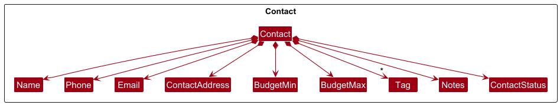
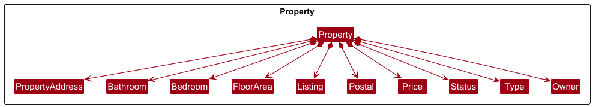

## Table of Contents

1. [Setting up](#1-setting-up)
2. [Design](#2-design)
   1. [Architecture](#21-architecture)
   2. [UI component](#22-ui-component)
   3. [Logic component](#23-logic-component)
   4. [Model component](#24-model-component)
   5. [Storage component](#25-storage-component)
   6. [Common classes](#26-common-classes)
3. [Implementation](#3-implementation)
   1. [Contact management](#32-contact-management)
   2. [Property management](#33-property-management)
   3. [Contact–property linking](#34-clientproperty-linking)
4. [Documentation, Logging, Testing, Configuration, Dev-Ops](#4-documentation-logging-testing-configuration-dev-ops)
5. [Appendix: Command Parameters](#appendix-command-parameters)
6. [Appendix: Product Scope](#appendix-product-scope)
7. [Appendix: User Stories](#appendix-user-stories)
8. [Appendix: Use Cases](#appendix-use-cases)
9. [Appendix: Non-Functional Requirements](#appendix-non-functional-requirements)
10. [Appendix: Glossary](#appendix-glossary)
11. [Appendix: Instructions for Manual Testing](#appendix-instructions-for-manual-testing)
12. [Appendix: Planned Enhancements](#appendix-planned-enhancements)
13. [Appendix: Efforts](#appendix-effort)
14. [Appendix: Continuous Integration](#appendix-continuous-integration--continuous-deployment)

---------------------------------------------------------------------------------------------------------------------

## Acknowledgements

TheRealDeal is a greenfield group project that is based on [addressbook-level3](https://github.com/se-edu/addressbook-level3)(AB3) created by [SE-EDU](https://se-education.org/).

## Legend
These boxes in the Developer Guide has additional information that you should take note of.

**:information_source: Important:** 
Highlights important details to be aware of.

:bulb: **Tip:** 
Provides you with helpful advice like keyboard shortcuts to use the application more effectively.

:exclamation: **Caution:** 
Warns you of potential issues to should watch out for.

---------------------------------------------------------------------------------------------------------------------

## 1. Setting up

Refer to the guide [_Setting up and getting started_](SettingUp.md).

---------------------------------------------------------------------------------------------------------------------

## 2. Design

:bulb: **Tip:** The `.puml` files used to create diagrams are in the `docs/diagrams` folder.  
Click [here](https://se-education.org/guides/tutorials/plantUml.html) to learn how to create and edit the diagrams.

### 2.1. Architecture

The ***Architecture Diagram*** given above explains the high-level design of the App.

Given below is a quick overview of main components and how they interact with each other.

**Main components of the architecture**

**`Main`** (consisting of classes [`Main`](https://github.com/AY2526S1-CS2103T-W10-2/tp/blob/master/src/main/java/seedu/address/Main.java) and [`MainApp`](https://github.com/AY2526S1-CS2103T-W10-2/tp/blob/master/src/main/java/seedu/address/MainApp.java)) is in charge of the app launch and shut down.
* At app launch, it initializes the other components in the correct sequence, and connects them up with each other.
* At shut down, it shuts down the other components and invokes cleanup methods where necessary.

The bulk of the app's work is done by the following four components:

* [**`UI`**](#22-ui-component): The UI of the App.
* [**`Logic`**](#23-logic-component): The command executor.
* [**`Model`**](#24-model-component): Holds the data of the App in memory.
* [**`Storage`**](#25-storage-component): Reads data from, and writes data to, the hard disk.

[**`Commons`**](#26-common-classes) represents a collection of classes used by multiple other components.

**How the architecture components interact with each other**

The *Sequence Diagram* below shows how the components interact when a user runs `addproperty address/123 Orchard Rd postal/238888 ...` to add a new listing.

Each of the four main components (also shown in the diagram above),

* defines its *API* in an `interface` with the same name as the Component.
* implements its functionality using a concrete `{Component Name}Manager` class (which follows the corresponding API `interface` mentioned in the previous point.

For example, the `Logic` component defines its API in the `Logic.java` interface and implements its functionality using the `LogicManager.java` class which follows the `Logic` interface. Other components interact with a given component through its interface rather than the concrete class (reason: to prevent outside component's being coupled to the implementation of a component), as illustrated in the (partial) class diagram below.

The sections below give more details of each component.

### 2.2. UI component

The **API** of this component is specified in [`Ui.java`](https://github.com/AY2526S1-CS2103T-W10-2/tp/blob/master/src/main/java/seedu/address/ui/Ui.java)

The UI consists of a `MainWindow` that is made up of parts e.g.`CommandBox`, `ResultDisplay`, `ContactListPanel`, `StatusBarFooter` etc. All these, including the `MainWindow`, inherit from the abstract `UiPart` class which captures the commonalities between classes that represent parts of the visible GUI.

The `UI` component uses the JavaFx UI framework. The layout of these UI parts are defined in matching `.fxml` files that are in the `src/main/resources/view` folder. For example, the layout of the [`MainWindow`](https://github.com/se-edu/addressbook-level3/tree/master/src/main/java/seedu/address/ui/MainWindow.java) is specified in [`MainWindow.fxml`](https://github.com/se-edu/addressbook-level3/tree/master/src/main/resources/view/MainWindow.fxml)

The `UI` component,

* executes user commands using the `Logic` component.
* listens for changes to `Model` data so that the UI can be updated with the modified data.
* keeps a reference to the `Logic` component, because the `UI` relies on the `Logic` to execute commands.
* depends on some classes in the `Model` component, as it displays `Contact` object residing in the `Model`.

### 2.3. Logic component

**API** : [`Logic.java`](https://github.com/AY2526S1-CS2103T-W10-2/tp/blob/master/src/main/java/seedu/address/logic/Logic.java)

Here's a (partial) class diagram of the `Logic` component:

The sequence diagram below illustrates the interactions within the `Logic` component, taking `execute("delete 1")` API call as an example.

:information_source: **Note:** The lifeline for `DeleteCommandParser` should end at the destroy marker (X) but due to a limitation of PlantUML, the lifeline continues till the end of diagram.

How the `Logic` component works:

1. When `Logic` is called upon to execute a command, it hands the raw text to a `UnifiedCommandParser`, which delegates to feature-specific parsers (e.g. `PropertyBookParser`) until one recognises the syntax (such as `FilterPropertyCommandParser`).
1. This results in a `Command` object (more precisely, an object of one of its subclasses e.g., `FilterPropertyCommand`) which is executed by the `LogicManager`.
1. The command can communicate with the `Model` when it is executed (e.g. to update the filtered property list). 
   Note that although this is shown as a single step in the diagram above (for simplicity), in the code it can take several interactions (between the command object and the `Model`) to achieve.
1. The result of the command execution is encapsulated as a `CommandResult` object which is returned back from `Logic`.

Here are the other classes in `Logic` (omitted from the class diagram above) that are used for parsing a user command:

How the parsing works:
* When called upon to parse a user command, the `AddressBookParser` class creates an `XYZCommandParser` (`XYZ` is a placeholder for the specific command name e.g., `AddCommandParser`) which uses the other classes shown above to parse the user command and create a `XYZCommand` object (e.g., `AddCommand`) which the `AddressBookParser` returns back as a `Command` object.
* All `XYZCommandParser` classes (e.g., `AddCommandParser`, `DeleteCommandParser`, ...) inherit from the `Parser` interface so that they can be treated similarly where possible e.g, during testing.

### 2.4. Model component
**API** : [`Model.java`](https://github.com/AY2526S1-CS2103T-W10-2/tp/blob/master/src/main/java/seedu/address/model/Model.java)

The `Model` component,

* stores the address book data i.e., all `Contact` objects (which are contained in a `UniqueContactList` object).
* stores the property book data i.e., all `Property` objects (which are contained in a `UniquePropertyList` object).
* stores the currently 'selected' `Contact`/`Property` objects (e.g., results of a filter query) as a separate _filtered_ list which is exposed to outsiders as an unmodifiable `ObservableList<Contact>`/`ObservableList<Property>` that can be 'observed' e.g. the UI can be bound to this list so that the UI automatically updates when the data in the list change.
* stores a `UserPrefs` object that represents the user’s preferences. This is exposed to the outside as a `ReadOnlyUserPrefs` objects.
* does not depend on any of the other three components (as the `Model` represents data entities of the domain, they should make sense on their own without depending on other components)

### 2.5. Storage component

**API** : [`Storage.java`](https://github.com/AY2526S1-CS2103T-W10-2/tp/blob/master/src/main/java/seedu/address/storage/Storage.java)

The `Storage` component,
* can save address book data, property book data and user preference data in JSON format, and read them back into corresponding objects.
* inherits from all of `AddressBookStorage`, `PropertyBookStorage` and `UserPrefStorage`, which means it can be treated as any (if only the functionality of only one is needed).
* depends on some classes in the `Model` component (because the `Storage` component's job is to save/retrieve objects that belong to the `Model`)

### 2.6. Common classes

Classes used by multiple components are in the `seedu.address.commons` package. These classes provide utility functions that are used in many classes such as `StringUtil`, `ToStringBuilder` etc.

---------------------------------------------------------------------------------------------------------------------

## 3. Implementation

This section describes some noteworthy details on how certain features are implemented.

### 3.1. General Features

These features do not require any parameters and do not have a corresponding `Parser` class so is directly instantiated in `AddressBookParser`.

#### <u> Help Command</u> (`help`)
The `HelpCommand` opens up a separate window containing a link to the User Guide.

##### Design Considerations
We designed the `HelpCommand` to let the user copy and navigate to the User Guide link directly.  

:bulb: **Tip:** 
Users can also press the <code>F1</code> key to open the help window

#### <u> List Command</u> (`list`)
The `ListCommand` resets all current filters and displays all the contacts/properties stored in the application.

##### Execution
The `ListCommand` calls the `Model` component to update the `FilteredList<Contact>` and `FilteredList<Property>` to show all of the `Contact` and `Property` in the list.

**:information_source: Important:** 
Users can switch to the list of contacts with: <code>filtercontact</code> 
Users can switch to the list of properties with: <code>filterproperty</code>

##### Design Considerations
We designed the `ListCommand` to provide users with a quick and easy way to view all `Contact` and `Property`. 

#### <u>Clear Command</u> (`clear`)
The `ClearCommand` allows users to delete all contacts and properties stored in the application

##### Execution
The `ClearCommand` sets the `Model` to be reference a new `AddressBook` and `PropertyBook` which effectively deletes all data that was previously stored.

##### Design Considerations
We designed the `ClearCommand` to let users easily remove any data stored in the application and start afresh.

#### <u>Exit Command</u> (`exit`)
The `ExitCommand` allows users to close the application.

##### Execution
The `ExitCommand` invokes the `handleExit` method in the `MainWindow` class which closes the UI (including the help window).

##### Design Considerations
As TheRealDeal is a CLI-based application, the `ExitCommand` can be used to exit the application using the CLI.

### 3.2. Contact management

All contacts are stored as `Contact` objects inside the `UniqueContactList` object under the `AdressBook` component.   
There is also an additional `FilteredList<Contact>` inside the `ModelManager` that stores the `Contact` that are displayed on the UI which is updated whenever the user issues a command that changes the UI.

#### <u>Add Command</u> (`addcontact`)
The `addcontact` command is designed to add a new contact to the address book.

Compulsory fields:
- Name
- Phone Number

Optional Fields:
- Address
- Email
- Minimum Budget
- Maximum Budget
- Tag
- Notes
- Status

##### Parsing and Validating User Input
The `AddContactCommandParser` class is responsible for parsing the command input.
It utilises `ArgumentTokenizer` to split the input string based on defined prefixes (`PREFIX_NAME`, `PREFIX_PHONE`, etc)

The parser constructs a new `Person` object that is wrapped inside a `AddContactCommand`.

Validation done:
- Ensures compulsory fields are present
- Ensures no duplicate fields are provided
- Ensures each individual field meets the constraints of that field (refer [here](#appendix-a-command-parameters) for the constraints)
- Unknown parameters provided will throw a `ParseException`

##### Execution
The `AddContactCommand` class generates the UUID for the `Person` object and checks for duplicates in the address book before adding the new contact.

#### <u>Delete Command</u> (`deletecontact`)
The `deletecontact` command is designed to delete an existing contact from the address book, identified by their UUID.

Compulsory fields:
- UUID

##### Parsing and Validating User Input
The `DeleteContactCommandParser` class is responsible for parsing the command input.
Documentation pending.

#### <u>Edit Command</u> (`editcontact`)
The `editcontact` command is designed to edit a contact in the address book, identified by their UUID.

Compulsory fields:
- UUID

Optional Fields:
- Name
- Phone Number
- Address
- Email
- Minimum Budget
- Maximum Budget
- Tag
- Notes
- Status

##### Parsing and Validating User Input
The `EditContactCommandParser` class is responsible for parsing the command input.
It utilises `ArgumentTokenizer` to split the input string based on defined prefixes (`PREFIX_NAME`, `PREFIX_PHONE`, etc)
The UUID is also validated and parsed.

The parser creates an `EditPersonDescriptor` object that stores the newly edited fields.

Validation done:
- Same validation done as `addcontact`
- At least one field must be edited
- New person must not already be in the address book

##### Execution
The `EditContactCommand` executes by finding the target person based on their UUID, creating an edited `Person` object and updating the person in the address book with the new details.

#### <u>Filter Contact Command</u> (`filtercontact`)
The `filtercontact` command filters the contacts in the address book based on the criteria given.

Optional Fields:
- Name
- Phone Number
- Address
- Email
- Minimum Budget
- Maximum Budget
- Tag
- Notes
- Status
- Limit
- Offset

##### Parsing and Validating User Input
The `FilterContactCommandParser` is responsible for parsing the command input. It utilises `ArgumentTokenizer` to split the input string based on defined prefixes (`PREFIX_NAME`, `PREFIX_PHONE`, etc)   
A `FilterContactPredicate` is created that encapsulates all the filter conditions and is used to test whether a contact matches the given filters.

Validation done:
- Same validation done as `addcontact`
- Proper data types and formats for numeric fields (e.g. budget, limit, offset)

##### Execution
`FilterContactCommand` applies the `FilterContactPredicate` over the existing filtered contact list and produces a list of matching contacts. It is also changed based on the `limit` and `offset` given.
The UI is then updated based on which contacts that match the predicate.

### 3.3. Property management

#### `AddPropertyCommand` (`addproperty`)
`AddPropertyCommand` accepts a full set of property descriptors (address, postal code, price, type, status, bedroom/bathroom counts, floor area, listing type, and owner UUID) and constructs a `Property` domain object before execution. During `execute`, the command requests a fresh `Uuid` from `PropertyBook#generateNextUuid()` and clones the staged property with this identifier via `Property#duplicateWithNewUuid`. The updated instance becomes the canonical version that is checked against `Model#hasProperty`; duplicates are detected through `Property#isSameProperty`, which currently compares address + postal pairs. When no conflict exists, the property is persisted with `Model#addProperty(propertyWithUuid)` and the success message is formed with `Messages.format` to surface that new UUID to the user. Any attempt to add a property that already exists raises a `CommandException` carrying `MESSAGE_DUPLICATE_PROPERTY`.

#### `DeletePropertyCommand` (`deleteproperty`)
`DeletePropertyCommand` expects a property UUID. At runtime it reads `Model#getFilteredPropertyList()` (which reflects the properties currently shown to the user), locates the matching `Property` by identifier, and removes it through `Model#deleteProperty`. If the supplied UUID is absent from the active view, the command throws `CommandException(MESSAGE_INVALID_PROPERTY_DISPLAYED_ID)` to signal that the requested target is not deletable in the current context. The success response mirrors `Messages.format` to confirm the property that was deleted.

#### `ShowPropertiesCommand` (`showproperties`)
Documentation pending.

#### <u>Mark Property as Sold Command</u> (`sold`)
The `sold` command finds properties by they UUID and changes the status of the property to unavailable.

Compulsory fields:
- UUID (using `p/` prefix)

##### Parsing and Validating User Input
The `MarkSoldCommandParser` is responsible for parsing the command input.

Validation done:
- No duplicate UUID is given
- No empty UUID is given
- Property with the given UUID exists

##### Execution
The `MarkSoldCommand` executes by retrieving the `Property` object for each UUID and creating a new `Property` object with the same attributes but with its `Status` as unavailable to replace the old `Property`.

#### <u>Mark Property as Unsold Command</u> (`unsold`)
The `unsold` command finds properties by they UUID and changes the status of the property to unavailable.

Compulsory fields:
- UUID (using `p/` prefix)

##### Parsing and Validating User Input
The `MarkUnsoldCommandParser` is responsible for parsing the command input.

Validation done:
- Same validation done as `sold`

##### Execution
The `MarkUnsoldCommand` executes by retrieving the `Property` object for each UUID and creating a new `Property` object with the same attributes but with its `Status` as unavailable to replace the old `Property`.

### 3.4. Client–property linking

#### `LinkCommand` (`link`)
The `link` command is designed to link contacts in the address book to properties in the property book, as either buyers or sellers, each identified by their UUID.

Compulsory fields:
- Contact UUID
- Property UUID
- Relationship (buyer/seller)

Optional fields:
- Additional contact UUIDs
- Additional property UUIDs

##### Parsing and Validating User Input
The `LinkCommandParser` class is responsible for parsing the command input.
It utilises `ArgumentTokenizer` to split the input string based on defined prefixes (`PREFIX_CONTACT_ID`, `PREFIX_PROPERTY_ID`, `PREFIX_LINK_RELATIONSHIP`)
Each UUID is also validated and parsed.

The parser creates an `LinkDescriptor` object that stores the parsed UUIDs and relationship.

Validation done:
- No duplicate relationship parameter

##### Execution
Documentation pending.

#### `UnlinkCommand` (`unlink`)
The `unlink` command is designed to unlink contacts in the address book from properties in the property book, each identified by their UUID.

Compulsory fields:
- Contact UUID
- Property UUID

Optional fields:
- Additional contact UUIDs
- Additional property UUIDs

##### Parsing and Validating User Input
The `UnlinkCommandParser` class is responsible for parsing the command input.
It utilises `ArgumentTokenizer` to split the input string based on defined prefixes (`PREFIX_CONTACT_ID`, `PREFIX_PROPERTY_ID`)
Each UUID is also validated and parsed.

The parser creates an `UnlinkDescriptor` object that stores the parsed UUIDs and relationship.

##### Execution
Documentation pending.

#### `ShowClientsCommand` (`showclients`)
Currently returns a placeholder message while property–client association storage is being developed.

### 4. Documentation, Logging, Testing, Configuration, Dev-Ops

[Documentation guide](Documentation.md) 
[Logging guide](Logging.md) 
[Testing guide](Testing.md) 
[Configuration guide](Configuration.md) 
[DevOps guide](DevOps.md)

## Appendix: Command Parameters
This table shows every parameter and prefix used in TheRealDeal.

**:information_source: Important:** 
If the command states that the prefix is optional e.g. <code>n/NAME [t/TAG]</code> 
an empty parameter will be the same as not having the prefix 
e.g. <code>n/NAME t/</code> is the same as <code>n/NAME</code>

| Parameter                             | Prefix  | Constraints                                                                                                                                                                                                                                                                  |
|---------------------------------------|---------|------------------------------------------------------------------------------------------------------------------------------------------------------------------------------------------------------------------------------------------------------------------------------|
| Name                                  | n/      | Alphabetical characters (a-z, A-Z, 0-9) or spaces                                                                                                                                                                                                                            |
| Phone Number                          | phone/  | Only numeric digits (0-9), and it should be at least 3 digits long                                                                                                                                                                                                           |
| Email                                 | e/      | Should follow the format: name@example.com. The part before @ can contain letters, numbers, and the symbols `+`, `_`, `.`, `-` but cannot start or end with a symbol. The part after @ must be a valid alphanumeric domain and end with at least 2 characters after the `.`. |
| Address (Contact or Property)         | a/      | Can take any character. Maximum of 200 characters                                                                                                                                                                                                                            |
| Tag                                   | t/      | Should only be these (case-insensitive): buyer, seller, tenant, landlord                                                                                                                                                                                                     |
| Minimum Budget (in Singapore Dollars) | min/    | Non-negative integer. If not provided, will have a default of $0                                                                                                                                                                                                             |
| Maximum Budget (in Singapore Dollars) | max/    | Non-negative integer and more than the minimum budget. If not provided, will have a default of $200,000,000,000                                                                                                                                                              |
| Notes                                 | notes/  | Can take any character. Maximum of 500 characters                                                                                                                                                                                                                            |
| Status (Contact)                      | s/      | Should only be these (case-insensitive): active, inactive                                                                                                                                                                                                                    |
| Limit                                 | limit/  | An integer more than 0                                                                                                                                                                                                                                                       |
| Offset                                | offset/ | An integer more than or equals to 0                                                                                                                                                                                                                                          |
| Number of Bathrooms                   | bath/   | An integer more than 0                                                                                                                                                                                                                                                       |
| Number of Bedrooms                    | bed/    | An integer more than 0                                                                                                                                                                                                                                                       |
| Floor Area (square feet)              | f/      | An integer between 50 and 100,000 (inclusive)                                                                                                                                                                                                                                |
| Listing                               | l/      | Should only be these (case-insensitive): sale, rent                                                                                                                                                                                                                          |
| Postal Code                           | postal/ | A 6-digit Singapore postal code                                                                                                                                                                                                                                              |
| Status (Property)                     | status/ | Should only be these (case-insensitive): available, unavailable                                                                                                                                                                                                              |
| Owner                                 | o/      |                                                                                                                                                                                                                                                                              |
| Price (in Singapore Dollars)          | price/  | An integer between 0 and 1,000,000,000,000 (inclusive)                                                                                                                                                                                                                       |
| Type                                  | type/   | Should only be these (case-insensitive): hdb, condo, landed, apartment, office, others                                                                                                                                                                                       |
| Property ID                           | p/      | An integer more than 0 and must be an ID of an existing property                                                                                                                                                                                                             |
| Contact ID                            | r/      | An integer more than 0 and must be an ID of an existing contact                                                                                                                                                                                                              |
| Relationship                          | c/      | Should only be these (case-insensitive): buyer, seller                                                                                                                                                                                                                       |

## Appendix: Product Scope

**Target user profile**:

* real estate agents
* has to manage a lot of clients with different informations
* has to manage large property list
* prefer desktop apps over other types
* can type fast
* prefers typing to mouse interactions
* is reasonably comfortable using CLI apps

**Value proposition**: manage clients faster than a typical mouse/GUI driven app

## Appendix: User Stories

Priorities: High (must have) - `* * *`, Medium (nice to have) - `* *`, Low (unlikely to have) - `*`

| Priority | As a…                        | I want to…                                       | So that I can…                                                           |
| -------- | ---------------------------- | ------------------------------------------------ | ------------------------------------------------------------------------ |
| `* * *`  | user                         | add contacts                                     | keep track of my clients                                                 |
| `* * *`  | user                         | store properties                                 | keep track of my advertising properties                                  |
| `* * *`  | user                         | delete contacts                                  | remove contacts that I no longer need                                    |
| `* * *`  | user                         | delete properties                                | remove properties that I no longer need                                  |
| `* * *`  | user                         | filter my contacts by their details              | find and prioritise clients easily                                       |
| `* * *`  | user                         | filter my properties by criteria                    | find my properties for my clients easily and better match client's needs |
| `* * *`  | user                         | track client associations to properties          | easily cross-reference clients                                           |
| `* * *`  | user                         | track when properties are sold                   | filter them from searches                                                |
| `* * *`  | detail-oriented user         | view a client’s full profile details             | prepare before meeting or calling them                                   |
| `* *`    | user                         | edit stored information                          | avoid manually deleting and adding data back when something changes      |
| `* *`    | collaborating user           | import Excel contact lists into the system       | avoid adding contacts one by one                                         |
| `* *`    | user                         | record the dates of client property visits       | maintain a clear history of interactions                                 |
| `* *`    | collaborating user           | export data of contacts                          | pass the information to associated contacts                              |
| `* *`    | user                         | draft messages based on client profiles          | provide updates quickly and professionally                               |
| `* *`    | user                         | mark clients as “active” or “inactive”           |                                                                          |
| `* *`    | user                         | store signed contracts                           | quickly retrieve them if disputes or clarifications arise                |
| `* *`    | user                         | generate reports                                 | analyze performance and opportunities                                    |
| `* *`    | user                         | tag clients with labels                          | organise them better                                                     |
| `* *`    | user                         | track commission earned from each deal           | measure my performance                                                   |
| `* *`    | user                         | have a recent contact list                       |                                                                          |
| `*`      | user dealing with complaints | see the whole interaction history                | understand the context fully and manage the situation well               |
| `*`      | forgetful user               | set automatic reminders for contract expirations | avoid missing key dates                                                  |
| `*`      | user                         | mark and track the negotiation stage of a deal   | see deal progress                                                        |
| `*`      | user                         | generate detailed draft contracts automatically  | speed up the transaction process                                         |
| `*`      | forgetful user               | set reminders for follow-ups with clients        | avoid forgetting to contact them at the right time                             |

## Appendix: Use Cases

For all use cases below, the **System** is `TheRealDeal` and the **Actor** is the `user`, unless specified otherwise.

#### Use case: UC00 - Input Details

**Guarantee:** 
The input details will meet the required format and constraints for that command

**Main Success Scenario:**
1. User inputs details
2. System successfully parses the input details

   Use case ends

**Extensions**

* 1a. System detects a missing compulsory prefix
  * 1a1. System displays an error message and requests for new inputs

    Use case resumes at step 1  
  
* 1b. System detects a duplicate prefix
  * 1b1. System displays an error message and requests for new inputs

    Use case resumes at step 1  
  
* 1c. System detects an invalid prefix
  * 1c1. System displays an error message and requests for new inputs
    
    Use case resumes at step 1  
    
* 1d. System detects a parameter not meeting required constraints
  * 1d1. System displays an error message and requests for new inputs

    Use case resumes at step 1  
  
* 1e. System detects an invalid format
  * 1e1. System displays an error message and requests for new inputs

    Use case resumes at step 1  
  
* 1f. System detects duplicate details
    * 1e1. System displays an error message and requests for new inputs

      Use case resumes at step 1  

#### Use case: UC01 - Help Command

**Guarantee:** 
Separate help window will pop up

**Main Success Scenario:**
1. User enters the help command
2. System displays main help window

    Use case ends

#### Use case: UC02 - Exit Command

**Guarantee:** 
All application windows are closed

**Main Success Scenario:**
1. User enters the exit command
2. System closes all windows

   Use case ends

#### Use case: UC03 - List Command

**Guarantee:** 
Unfilter list of contacts or properties

**Main Success Scenario:**
1. User enters the list command
2. System will unfilter contacts and properties 

   Use case ends

#### Use case: UC04 - Clear Command

**Guarantee:** 
Deletes all contacts and properties

**Main Success Scenario:**
1. User enters the clear command
2. System will delete all contact and property data

   Use case ends

#### Use case: UC05 - Add a contact

**Main Success Scenario:**

1.  User chooses to add a contact and <u>enters the required inputs (UC0)</u>
2.  System stores the required information
3.  System displays a success message

    Use case ends

#### Use case: UC06 - Edit a contact

**Precondition:** The contact exists in the System

**Main Success Scenario:**

1.  User chooses to edit a contact and <u>enters the required inputs (UC0)</u>
2.  System updates the contact with the new details
3.  System displays a success message

    Use case ends

#### Use case: UC07 - Filter all contacts

**Main Success Scenario:**

1.  User chooses to filter contacts and <u>enters the required inputs (UC0)</u>
2.  System filters the contacts based on the details
3.  System displays new contact list

    Use case ends

#### Use case: UC08 - Delete a contact

**Main Success Scenario:**

1.  User chooses to delete a contact and <u>enters the required inputs (UC0)</u>
2.  System deletes the contact specified
3.  System displays a success message

    Use case ends

#### Use case: UC09 - Add a property

**Main Success Scenario:**

1.  User chooses to add a property and <u>enters the required inputs (UC0)</u>
2. System stores the required information
3. System displays a success message

    Use case ends

#### Use case: UC10 - Filter all properties

**Main Success Scenario:**

1.  User chooses to filter properties and <u>enters the required inputs (UC0)</u>
2.  System filters the properties based on the details
3.  System displays new property list

    Use case ends

#### Use case: UC11 - Delete a property

**Main Success Scenario:**

1.  User chooses to delete a property and <u>enters the required inputs (UC0)</u>
2.  System deletes the property specified
3.  System displays a success message

    Use case ends

#### Use case: UC12 - Mark properties as sold

**Main Success Scenario:**

1.  User chooses to mark properties as sold and <u>enters the required inputs (UC0)</u>
2.  System updates the properties as sold
3.  System displays a success message

    Use case ends

#### Use case: UC13 - Mark properties as unsold

**Main Success Scenario:**

1.  User chooses to mark properties as unsold and <u>enters the required inputs (UC0)</u>
2.  System updates the properties as unsold
3.  System displays a success message

    Use case ends

#### Use case: UC14 - Link properties to clients

**Main Success Scenario:**

1.  User chooses to link properties to clients and <u>enters the required inputs (UC0)</u>
2.  System updates the properties and clients
3.  System displays a success message

    Use case ends

#### Use case: UC15 - Unlink properties from clients

**Main Success Scenario:**

1.  User chooses to unlink properties from clients and <u>enters the required inputs (UC0)</u>
2.  System updates the properties and clients
3.  System displays a success message

    Use case ends

#### Use case: UC16 - Find clients linked to a property

**Main Success Scenario:**

1.  User chooses to find clients linked with a property and <u>enters the required inputs (UC0)</u>
2.  System displays a result information

    Use case ends

**Extensions**

* 1a. System finds no clients associated to the property
    * 1a1. System displays error message

      Use case ends

#### Use case: UC17 - Find properties linked to a client

**Main Success Scenario:**

1.  User chooses to find properties linked to a client and <u>enters the required inputs (UC0)</u>
2.  System displays a result information

    Use case ends

**Extensions**

* 1a. System finds no properties linked to a client
    * 1a1. System displays error message

      Use case ends

---------------------------------------------------------------------------------------------------------------------

## Appendix: Non-Functional Requirements

#### Business Rules

1. **User Accessibility**
   * The system should be usable by real estate agents with moderate computer skills
   * Command syntax should be intuitive for real estate professionals
   * Error messages should be domain-specific and actionable for real estate scenarios

2. **Data Integrity**
   * No duplicate clients or properties should be allowed based on unique identifiers

#### Technical Requirements

1. **Platform Support**
   * The system should support every mainstream OS (Windows, Linux, MacOS) that have Java 17 installed
   * Must work offline without internet connectivity for core functionalities
   * Should be deployable as a single JAR file for easy distribution

2. **Data Management**
   * The system should have automated backups and error recovery processes
   * The system's storage should be scalable and handle large datasets efficiently

3. **User Interface**
   * CLI commands should follow consistent patterns across all operations
   * Display should clearly distinguish between clients, properties, and associations
   * Must support standard copy-paste operations for data entry

#### Performance Requirements

1. **Response Time**
   * The system should respond to each command within 3 seconds under normal load

2. **Scalability**
   * The system should be able to hold up to 10,000 properties and 10,000 clients
   * Should efficiently handle relationships between clients and properties

3. **Resource Efficiency**
   * Memory usage should not exceed 512MB during normal operation
   * Application should run smoothly on systems with 4GB RAM
   * Disk space usage should grow linearly with data volume

#### Constraints

1. **Business Constraints**
   * Must accommodate typical real estate agency workflows

2. **Technical Constraints**
   * Must be developed using Java 17 and JavaFX for GUI components
   * Command-line interface must remain the primary interaction method

---------------------------------------------------------------------------------------------------------------------

## Appendix: Glossary

### Glossary

* **Mainstream OS**: Windows, Linux, Unix, MacOS
* **Client**: A contact (e.g. buyer, seller) managed by the real estate agent in the system
* **Property**: A real estate listing that can be bought or sold, with specific attributes like address, price and type
* **Association**: A relationship link between a client and property indicating the client's interest (as buyer) or ownership (as seller)
* **Client ID**: A unique identifier assigned to clients for precise identification
* **Property ID**: A unique identifier assigned to properties for precise identification
* **Role**: The relation of the client to the property (buyer, seller, tenant, landlord)
* **Status**: The current state of a client (lead/active/archived) or property (listed/sold/rented/off-market)
* **Listing**: Whether a property is available for sale or rent
* **Budget Range**: The minimum and maximum price range a buyer is willing to spend
* **Type**: Category of property such as HDB, condo or landed
* **Floor Area**: The size of a property measured in square feet

---------------------------------------------------------------------------------------------------------------------

## Appendix: Instructions for Manual Testing

Given below are instructions to test the app manually.

:information_source: **Note:** These instructions only provide a starting point for testers to work on;
testers are expected to do more *exploratory* testing.

### Launch and shutdown

1. Initial launch

   1. Download the jar file and copy into an empty folder

   1. Double-click the jar file Expected: Shows the GUI with a set of sample contacts. The window size may not be optimum.

1. Saving window preferences

   1. Resize the window to an optimum size. Move the window to a different location. Close the window.

   1. Re-launch the app by double-clicking the jar file. 
       Expected: The most recent window size and location is retained.

1. _{ more test cases …​ }_

### Deleting a contact

1. Deleting a contact while all contacts are being shown

   1. Prerequisites: List all contacts using the `list` command. Multiple contacts in the list.

   1. Test case: `delete 1` 
      Expected: First contact is deleted from the list. Details of the deleted contact shown in the status message. Timestamp in the status bar is updated.

   1. Test case: `delete 0` 
      Expected: No contact is deleted. Error details shown in the status message. Status bar remains the same.

   1. Other incorrect delete commands to try: `delete`, `delete x`, `...` (where x is larger than the list size) 
      Expected: Similar to previous.

1. _{ more test cases …​ }_

### Saving data

##### Missing data file
To simulate: 
Delete the `\data` folder and all `.json` files inside.

Expected: 
Opening the application will generate sample data based on `SampleDataUtil.java`. Adding or editing any contacts/properties will save the data inside the `\data` folder.

##### Corrupted data file
To simulate: 
Open `\data\addressbook.json` and add a `@` to `Contact` Name.

Expected: 
Opening the application will delete all contacts stored inside `addressbook.json`. No contacts will be shown on the GUI. Same steps can be carried out for `propertybook.json` by adding `abc` to `Property` Listing.

##### Editing data file while application is open
To simulate: 
Open application and delete the `\data` folder and all `.json` files inside.

Expected: 
No change in the GUI and performing any command that adds or edits any contacts/properties will recreate the `\data` folder and the previously deleted `.json` files.

---------------------------------------------------------------------------------------------------------------------

## Appendix: Planned Enhancements

Team size: 5

1. **Make command words and prefixes case-insensitive.** For example, `Addcontact` should be acceptable as a `addcontact` command and `N/` should be acceptable as a `Name` prefix. Users may make mistakes in the capitalisation of the commands and making the command words case-insensitive can help to save time.

2. **Allow special characters to be used in contact names.** The current validation for contact names requires it to only consist of alphanumeric characters and spaces. The does not support names with special characters like `/` or `-` (e.g. `s/o`, `John-Mary`). Future improvements aim to support this functionality.

3. **Phone Number lacks support for international formats.** The current validation for phone numbers requires it to be only numeric digits and to be at least 3 digits long. This does not support international contacts or the ability to specify country codes (e.g. `+60 123456789` or `(123)123-4567`). Future improvements aim to support international phone number formats.

---------------------------------------------------------------------------------------------------------------------

## Appendix: Effort

#### Difficulty Level and Effort Required
This project was significantly harder and took more time that the individual project. TheRealDeal is the first team-based software engineering project for all of us. Most of us had prior experience with a two-man project for NUS Orbital (CP2106) but this group project made it very difficult to split the workload and coordinate features.
  
Unlike AB3 which handles only `Contact`, this application handles both `Contact` and `Property` each with their distinct commands, models and UI components. This required a clear separation and linking between contacts and properties. Furthermore, this project was made significantly harder with the need of a comprehensive User Guide and Developer Guide.
  
A high proportion of effort was saved through reuse of AB3. Such examples include the `ReadOnlyPropertyBook` and `PropertyBook` which takes reference from `ReadOnlyAddressBook` and `AddressBook` which made it easier to implement the `Property` class as AB3 was easily extendable.

#### Challenges Faced
- More comprehensive input validation and testing because it is a CLI-based application
- Coordinating and agreeing on the use case and format of a command as many changes were made week after week
- Implementing complex parsers due to the presence of compulsory parameters, optional parameters or multi-word parameters

#### Achievements of the Project
- Extensive refactoring of AB3 with over 15,000 more lines of code with a high test coverage
- Comprehensive features that extend AB3 into a real estate management application
- Team collaboration and Software Engineering Principles (Git workflow, Issue tracking, Single Level of Abstraction, Logging)
- Extensive User Guide and Developer Guide with the aid of (Unified Modelling Language) UML diagrams

---------------------------------------------------------------------------------------------------------------------

## Appendix: Software Engineering Practices
Common Software Engineering Practices (SEP) has been carried out throughout this project. Testing is done automatically after each code change and is also deployed to GitHub at the same time.  

SEP has been carried out as follows:
1. Unit Testing and Test Coverage Analysis
2. Integrated GitHub tests (Continuous Integration / Continuous Deployment)
3. Version Control (GitHub)

#### Unit Testing and Test Coverage Analysis
Unit testing has been carried out in the form of [JUnit](https://docs.junit.org/current/user-guide/) tests of almost all Java classes. There are currently over 600 different test cases which can be seen [here](https://github.com/AY2526S1-CS2103T-W10-2/tp/tree/master/src/test).    
Test coverage refers to the extent in which the code is tested, and we have utilised [CodeCov](https://about.codecov.io/) to measure our code coverage. The code coverage can be seen [here](https://app.codecov.io/github/AY2526S1-CS2103T-W10-2/tp).    
As of v1.5, the test coverage is above 80%.

#### Integrated GitHub tests (Continuous Integration / Continuous Deployment)
We have utilised _**GitHub Actions**_ to carry out automated testing on Windows, MacOS and Ubuntu devices on every push or pull request. Through these tests, feature branches can be tested before they are merged to the master branch, which ensures that regressions are caught early and are not deployed.
The workflow file used can be seen [here](https://github.com/AY2526S1-CS2103T-W10-2/tp/blob/3fef75e58132ad7d04d4d2cfef54b701466e2f22/.github/workflows/gradle.yml).

#### Version Control (GitHub)
We have carried out version control in the form of GitHub Releases and can be seen [here](https://github.com/AY2526S1-CS2103T-W10-2/tp/releases).
