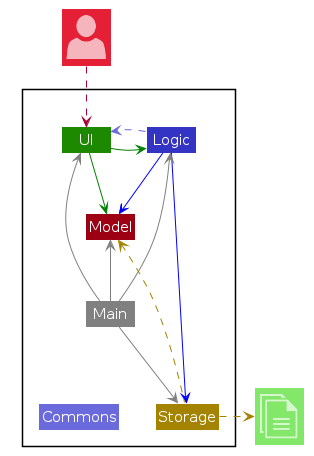
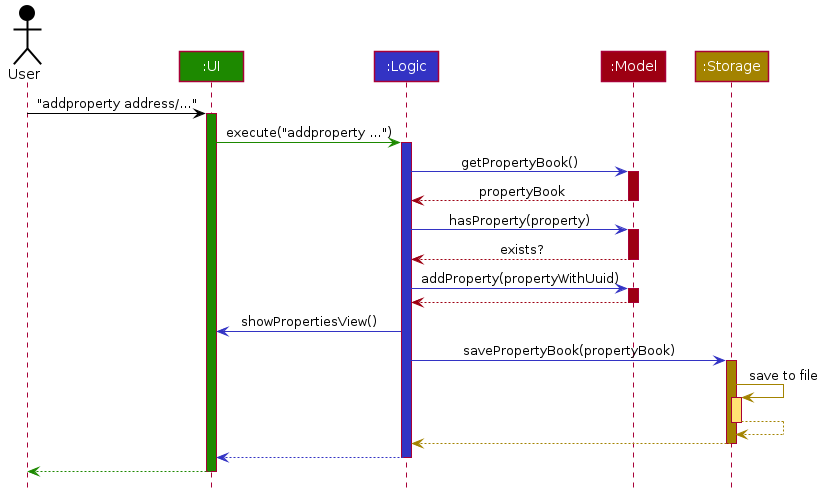
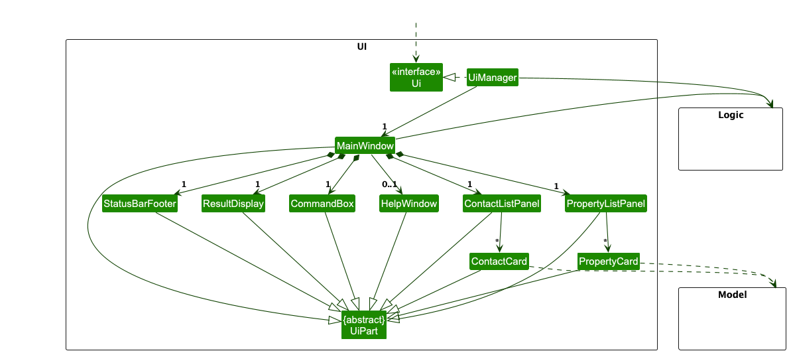
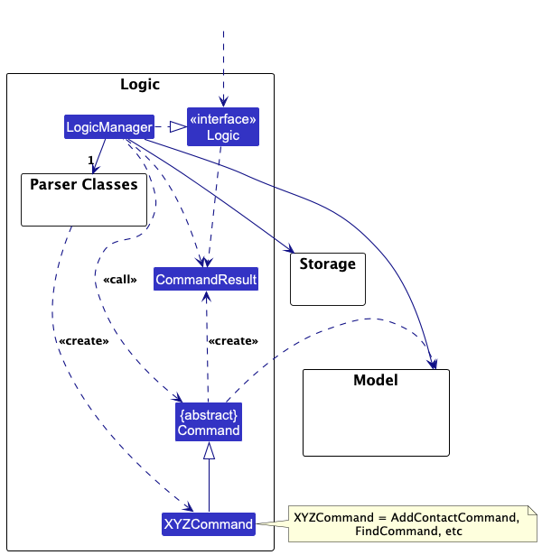
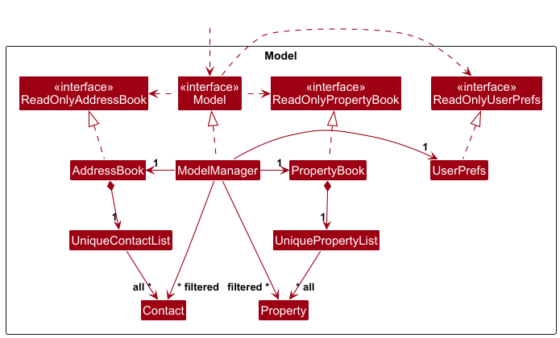

# TheRealDeal v1.0 - Developer Guide

## Table of Contents

1. [Setting up](#1-setting-up)
2. [Design](#2-design)
   1. [Architecture](#21-architecture)
   2. [UI component](#22-ui-component)
   3. [Logic component](#23-logic-component)
   4. [Model component](#24-model-component)
   5. [Storage component](#25-storage-component)
   6. [Common classes](#26-common-classes)
3. [Implementation](#3-implementation)
   1. [Contact management](#31-contact-management)
   2. [Property management](#32-property-management)
   3. [Contact–property linking](#33-clientproperty-linking)
   4. [Contact filtering](#34-contact-filtering)
   5. [Logging](#35-logging)
   6. [Configuration](#36-configuration)
   7. [Proposed undo/redo feature](#37-proposed-undoredo-feature)
   8. [Proposed data archiving](#38-proposed-data-archiving)
4. [Documentation](#4-documentation)
5. [Testing](#5-testing)
6. [Dev Ops](#6-dev-ops)
7. [Appendix A: Product Scope](#appendix-a-product-scope)
8. [Appendix B: User Stories](#appendix-b-user-stories)
9. [Appendix C: Use Cases](#appendix-c-use-cases)
10. [Appendix D: Non-Functional Requirements](#appendix-d-non-functional-requirements)
11. [Appendix E: Glossary](#appendix-e-glossary)
12. [Appendix F: Instructions for Manual Testing](#appendix-f-instructions-for-manual-testing)
13. [Appendix G: Efforts](#appendix-g-efforts)

---------------------------------------------------------------------------------------------------------------------

## Acknowledgements

* {list here sources of all reused/adapted ideas, code, documentation, and third-party libraries -- include links to the original source as well}

---------------------------------------------------------------------------------------------------------------------

## 1. Setting up

Refer to the guide [_Setting up and getting started_](SettingUp.md).

---------------------------------------------------------------------------------------------------------------------

## 2. Design

:bulb: **Tip:** The `.puml` files used to create diagrams are in this document `docs/diagrams` folder. Refer to the [_PlantUML Tutorial_ at se-edu/guides](https://se-education.org/guides/tutorials/plantUml.html) to learn how to create and edit diagrams.

### 2.1. Architecture

The ***Architecture Diagram*** given above explains the high-level design of the App.

Given below is a quick overview of main components and how they interact with each other.

**Main components of the architecture**

**`Main`** (consisting of classes [`Main`](https://github.com/se-edu/addressbook-level3/tree/master/src/main/java/seedu/address/Main.java) and [`MainApp`](https://github.com/se-edu/addressbook-level3/tree/master/src/main/java/seedu/address/MainApp.java)) is in charge of the app launch and shut down.
* At app launch, it initializes the other components in the correct sequence, and connects them up with each other.
* At shut down, it shuts down the other components and invokes cleanup methods where necessary.

The bulk of the app's work is done by the following four components:

* [**`UI`**](#22-ui-component): The UI of the App.
* [**`Logic`**](#23-logic-component): The command executor.
* [**`Model`**](#24-model-component): Holds the data of the App in memory.
* [**`Storage`**](#25-storage-component): Reads data from, and writes data to, the hard disk.

[**`Commons`**](#26-common-classes) represents a collection of classes used by multiple other components.

**How the architecture components interact with each other**

The *Sequence Diagram* below shows how the components interact with each other for the scenario where the user issues the command `delete 1`.

Each of the four main components (also shown in the diagram above),

* defines its *API* in an `interface` with the same name as the Component.
* implements its functionality using a concrete `{Component Name}Manager` class (which follows the corresponding API `interface` mentioned in the previous point.

For example, the `Logic` component defines its API in the `Logic.java` interface and implements its functionality using the `LogicManager.java` class which follows the `Logic` interface. Other components interact with a given component through its interface rather than the concrete class (reason: to prevent outside component's being coupled to the implementation of a component), as illustrated in the (partial) class diagram below.

The sections below give more details of each component.

### 2.2. UI component

The **API** of this component is specified in [`Ui.java`](https://github.com/se-edu/addressbook-level3/tree/master/src/main/java/seedu/address/ui/Ui.java)

The UI consists of a `MainWindow` that is made up of parts e.g.`CommandBox`, `ResultDisplay`, `ContactListPanel`, `StatusBarFooter` etc. All these, including the `MainWindow`, inherit from the abstract `UiPart` class which captures the commonalities between classes that represent parts of the visible GUI.

The `UI` component uses the JavaFx UI framework. The layout of these UI parts are defined in matching `.fxml` files that are in the `src/main/resources/view` folder. For example, the layout of the [`MainWindow`](https://github.com/se-edu/addressbook-level3/tree/master/src/main/java/seedu/address/ui/MainWindow.java) is specified in [`MainWindow.fxml`](https://github.com/se-edu/addressbook-level3/tree/master/src/main/resources/view/MainWindow.fxml)

The `UI` component,

* executes user commands using the `Logic` component.
* listens for changes to `Model` data so that the UI can be updated with the modified data.
* keeps a reference to the `Logic` component, because the `UI` relies on the `Logic` to execute commands.
* depends on some classes in the `Model` component, as it displays `Contact` object residing in the `Model`.

### 2.3. Logic component

**API** : [`Logic.java`](https://github.com/se-edu/addressbook-level3/tree/master/src/main/java/seedu/address/logic/Logic.java)

Here's a (partial) class diagram of the `Logic` component:

The sequence diagram below illustrates the interactions within the `Logic` component, taking `execute("delete 1")` API call as an example.

:information_source: **Note:** The lifeline for `DeleteCommandParser` should end at the destroy marker (X) but due to a limitation of PlantUML, the lifeline continues till the end of diagram.

How the `Logic` component works:

1. When `Logic` is called upon to execute a command, it is passed to an `AddressBookParser` object which in turn creates a parser that matches the command (e.g., `DeleteCommandParser`) and uses it to parse the command.
1. This results in a `Command` object (more precisely, an object of one of its subclasses e.g., `DeleteCommand`) which is executed by the `LogicManager`.
1. The command can communicate with the `Model` when it is executed (e.g. to delete a contact). 
   Note that although this is shown as a single step in the diagram above (for simplicity), in the code it can take several interactions (between the command object and the `Model`) to achieve.
1. The result of the command execution is encapsulated as a `CommandResult` object which is returned back from `Logic`.

Here are the other classes in `Logic` (omitted from the class diagram above) that are used for parsing a user command:

How the parsing works:
* When called upon to parse a user command, the `AddressBookParser` class creates an `XYZCommandParser` (`XYZ` is a placeholder for the specific command name e.g., `AddCommandParser`) which uses the other classes shown above to parse the user command and create a `XYZCommand` object (e.g., `AddCommand`) which the `AddressBookParser` returns back as a `Command` object.
* All `XYZCommandParser` classes (e.g., `AddCommandParser`, `DeleteCommandParser`, ...) inherit from the `Parser` interface so that they can be treated similarly where possible e.g, during testing.

### 2.4. Model component
**API** : [`Model.java`](https://github.com/se-edu/addressbook-level3/tree/master/src/main/java/seedu/address/model/Model.java)

The `Model` component,

* stores the address book data i.e., all `Contact` objects (which are contained in a `UniqueContactList` object).
* stores the currently 'selected' `Contact` objects (e.g., results of a search query) as a separate _filtered_ list which is exposed to outsiders as an unmodifiable `ObservableList<Contact>` that can be 'observed' e.g. the UI can be bound to this list so that the UI automatically updates when the data in the list change.
* stores a `UserPref` object that represents the user’s preferences. This is exposed to the outside as a `ReadOnlyUserPref` objects.
* does not depend on any of the other three components (as the `Model` represents data entities of the domain, they should make sense on their own without depending on other components)

:information_source: **Note:** An alternative (arguably, a more OOP) model is given below. It has a `Tag` list in the `AddressBook`, which `Contact` references. This allows `AddressBook` to only require one `Tag` object per unique tag, instead of each `Contact` needing their own `Tag` objects. 

### 2.5. Storage component

**API** : [`Storage.java`](https://github.com/se-edu/addressbook-level3/tree/master/src/main/java/seedu/address/storage/Storage.java)

The `Storage` component,
* can save both address book data and user preference data in JSON format, and read them back into corresponding objects.
* inherits from both `AddressBookStorage` and `UserPrefStorage`, which means it can be treated as either one (if only the functionality of only one is needed).
* depends on some classes in the `Model` component (because the `Storage` component's job is to save/retrieve objects that belong to the `Model`)

### 2.6. Common classes

Classes used by multiple components are in the `seedu.address.commons` package.
---------------------------------------------------------------------------------------------------------------------

## 3. Implementation

This section describes some noteworthy details on how certain features are implemented.

### 3.1. Contact management

The following subsections enumerate the currently implemented commands for managing contacts and core application behaviour. Detailed write-ups will be added as each feature stabilises.

#### `AddCommand` (`addcontact`)
Documentation pending.

#### `DeleteCommand` (`delete`)
Documentation pending.

#### `EditCommand` (`edit`)
Documentation pending.

#### `ListCommand` (`list`)
Documentation pending.

#### `ClearCommand` (`clear`)
Documentation pending.

#### `HelpCommand` (`help`)
Documentation pending.

#### `ExitCommand` (`exit`)
Documentation pending.

### 3.2. Property management

#### `AddPropertyCommand` (`addproperty`)
`AddPropertyCommand` accepts a full set of property descriptors (address, postal code, price, type, status, bedroom/bathroom counts, floor area, listing type, and owner UUID) and constructs a `Property` domain object before execution. During `execute`, the command requests a fresh `Uuid` from `PropertyBook#generateNextUuid()` and clones the staged property with this identifier via `Property#duplicateWithNewUuid`. The updated instance becomes the canonical version that is checked against `Model#hasProperty`; duplicates are detected through `Property#isSameProperty`, which currently compares address + postal pairs. When no conflict exists, the property is persisted with `Model#addProperty(propertyWithUuid)` and the success message is formed with `Messages.format` to surface that new UUID to the user. Any attempt to add a property that already exists raises a `CommandException` carrying `MESSAGE_DUPLICATE_PROPERTY`.

#### `DeletePropertyCommand` (`deleteproperty`)
`DeletePropertyCommand` expects a property UUID. At runtime it reads `Model#getFilteredPropertyList()` (which reflects the properties currently shown to the user), locates the matching `Property` by identifier, and removes it through `Model#deleteProperty`. If the supplied UUID is absent from the active view, the command throws `CommandException(MESSAGE_INVALID_PROPERTY_DISPLAYED_ID)` to signal that the requested target is not deletable in the current context. The success response mirrors `Messages.format` to confirm the property that was deleted.

#### `ShowPropertiesCommand` (`showproperties`)
Documentation pending.

### 3.3. Client–property linking

#### `LinkCommand` (`link`)
Documentation pending.

#### `UnlinkCommand` (`unlink`)
Documentation pending.

#### `ShowClientsCommand` (`showclients`)
Currently returns a placeholder message while property–client association storage is being developed.

### 3.4. Contact filtering

#### `FilterContactCommand` (`filtercontact`)
Documentation pending.

### 3.5. Logging

Refer to the [Logging guide](Logging.md) for instrumentation and diagnostic practices, including logger configuration and log file expectations.

### 3.6. Configuration

Refer to the [Configuration guide](Configuration.md) for configuration file structure, editing workflow, and supported keys.

## 4. Documentation

* [Documentation guide](Documentation.md)

## 5. Testing

* [Testing guide](Testing.md)

## 6. Dev Ops

* [Logging guide](Logging.md)
* [Configuration guide](Configuration.md)
* [DevOps guide](DevOps.md)

## Appendix A: Product Scope

**Target user profile**:

* real estate agents
* has to manage a lot of clients with different informations
* has to manage large property list
* prefer desktop apps over other types
* can type fast
* prefers typing to mouse interactions
* is reasonably comfortable using CLI apps

**Value proposition**: manage clients faster than a typical mouse/GUI driven app

## Appendix B: User Stories

Priorities: High (must have) - `* * *`, Medium (nice to have) - `* *`, Low (unlikely to have) - `*`

| Priority | As a…                        | I want to…                                       | So that I can…                                                           |
| -------- | ---------------------------- | ------------------------------------------------ | ------------------------------------------------------------------------ |
| `* * *`  | user                         | add contacts                                     | keep track of my clients                                                 |
| `* * *`  | user                         | store properties                                 | keep track of my advertising properties                                  |
| `* * *`  | user                         | delete contacts                                  | remove contacts that I no longer need                                    |
| `* * *`  | user                         | delete properties                                | remove properties that I no longer need                                  |
| `* * *`  | user                         | filter my contacts by their details              | find and prioritise clients easily                                       |
| `* * *`  | user                         | filter my properties by criteria                    | find my properties for my clients easily and better match client's needs |
| `* * *`  | user                         | track client associations to properties          | easily cross-reference clients                                           |
| `* * *`  | user                         | track when properties are sold                   | filter them from searches                                                |
| `* * *`  | detail-oriented user         | view a client’s full profile details             | prepare before meeting or calling them                                   |
| `* *`    | user                         | edit stored information                          | avoid manually deleting and adding data back when something changes      |
| `* *`    | collaborating user           | import Excel contact lists into the system       | avoid adding contacts one by one                                         |
| `* *`    | user                         | record the dates of client property visits       | maintain a clear history of interactions                                 |
| `* *`    | collaborating user           | export data of contacts                          | pass the information to associated contacts                              |
| `* *`    | user                         | draft messages based on client profiles          | provide updates quickly and professionally                               |
| `* *`    | user                         | mark clients as “active” or “inactive”           |                                                                          |
| `* *`    | user                         | store signed contracts                           | quickly retrieve them if disputes or clarifications arise                |
| `* *`    | user                         | generate reports                                 | analyze performance and opportunities                                    |
| `* *`    | user                         | tag clients with labels                          | organise them better                                                     |
| `* *`    | user                         | track commission earned from each deal           | measure my performance                                                   |
| `* *`    | user                         | have a recent contact list                       |                                                                          |
| `*`      | user dealing with complaints | see the whole interaction history                | understand the context fully and manage the situation well               |
| `*`      | forgetful user               | set automatic reminders for contract expirations | avoid missing key dates                                                  |
| `*`      | user                         | mark and track the negotiation stage of a deal   | see deal progress                                                        |
| `*`      | user                         | generate detailed draft contracts automatically  | speed up the transaction process                                         |
| `*`      | forgetful user               | set reminders for follow-ups with clients        | avoid forgetting to contact them at the right time                             |

## Appendix C: Use Cases

(For all use cases below, the **System** is `TheRealDeal` and the **Actor** is the `user`, unless specified otherwise)

#### Use case: Add contact

**Main Success Scenario:**

1.  User chooses to add a new contact
2.  System requests contact details (name, phone number, email, etc.)
3.  User enters the required information
4.  System stores the required information
5.  System displays a success message

    Use case ends

**Extensions**

* 3a. System detects missing, incorrect or duplicate information

    * 3a1. System displays an error message and requests new inputs
    * 3a2. User enters information again

      Steps 3a1 - 3a2 are repeated until all data are valid

      Use case resumes at step 4

#### Use case: Delete contact

**Main Success Scenario:**

1.  User chooses to delete a contact
2.  System requests for which contact to delete
3.  User enters the contact to be deleted
4.  System removes the contact from the storage
5.  System displays a success message

    Use case ends

**Extensions**

* 3a. System detects missing, incorrect or duplicate information

    * 3a1. System displays an error message and requests new inputs
    * 3a2. User enters information again

      Steps 3a1 - 3a2 are repeated until all data are valid

      Use case resumes at step 4

#### Use case: Filter contact

**Main Success Scenario:**

1.  User chooses to filter contacts by contact details
2.  System requests contact details (name, phone number, email, etc.)
3.  User enters the required information
4.  System retrieves information and displays the contacts

    Use case ends

**Extensions**

* 3a. System detects missing, incorrect or duplicate information

    * 3a1. System displays an error message and requests new inputs
    * 3a2. User enters information again

      Steps 3a1 - 3a2 are repeated until all data are valid

      Use case resumes at step 4

* 4a. System finds no contacts matching the properties
    * 4a1. System displays "No contacts found" message

      Use case ends

#### Use case: Add property

**Main Success Scenario:**

1.  User chooses to add a new property
2.  System requests property details (address, no. of bedrooms, etc.)
3.  User enters the required information
4.  System stores the required information
5.  System displays a success message

    Use case ends

**Extensions**

* 3a. System detects missing, incorrect or duplicate information

    * 3a1. System displays an error message and requests new inputs
    * 3a2. User enters information again

      Steps 3a1 - 3a2 are repeated until all data are valid

      Use case resumes at step 4

#### Use case: Delete property

**Main Success Scenario:**

1.  User chooses to delete a property
2.  System requests for which property to delete
3.  User enters the property to be deleted
4.  System removes the property from the storage
5.  System displays a success message

    Use case ends

**Extensions**

* 3a. System detects missing, incorrect or duplicate information

    * 3a1. System displays an error message and requests new inputs
    * 3a2. User enters information again

      Steps 3a1 - 3a2 are repeated until all data are valid

      Use case resumes at step 4

#### Use case: Filter property

**Main Success Scenario:**

1.  User chooses to filter properties by property details
2.  System requests property details (address, no. of bedrooms, etc.)
3.  User enters the required information
4.  System retrieves information and displays the properties

    Use case ends

**Extensions**

* 3a. System detects missing, incorrect or duplicate information

    * 3a1. System displays an error message and requests new inputs
    * 3a2. User enters information again

      Steps 3a1 - 3a2 are repeated until all data are valid

      Use case resumes at step 4

* 4a. System finds no properties matching the properties
    * 4a1. System displays "No properties found" message

      Use case ends

#### Use case: Associate property to client

**Main Success Scenario:**

1.  User chooses to associate property to client
2.  System requests property details and client details
3.  User enters the required information
4.  System stores the required information
5.  System displays a success message

    Use case ends

**Extensions**

* 3a. System detects missing, incorrect or duplicate information

    * 3a1. System displays an error message and requests new inputs
    * 3a2. User enters information again

      Steps 3a1 - 3a2 are repeated until all data are valid

      Use case resumes at step 4

#### Use case: Unassociate property client

**Main Success Scenario:**

1.  User chooses to unassociate property to client
2.  System requests property details and client details
3.  User enters the required information
4.  System stores the required information
5.  System displays a success message

    Use case ends

**Extensions**

* 3a. System detects missing, incorrect or duplicate information

    * 3a1. System displays an error message and requests new inputs
    * 3a2. User enters information again

      Steps 3a1 - 3a2 are repeated until all data are valid

      Use case resumes at step 4

#### Use case: Mark property as sold

**Main Success Scenario:**

1.  User chooses to mark property as sold
2.  System requests property details
3.  User enters the required information
4.  System stores the required information
5.  System displays a success message

    Use case ends

**Extensions**

* 3a. System detects missing, incorrect or duplicate information

    * 3a1. System displays an error message and requests new inputs
    * 3a2. User enters information again

      Steps 3a1 - 3a2 are repeated until all data are valid

      Use case resumes at step 4

#### Use case: Mark property as unsold

**Main Success Scenario:**

1.  User chooses to mark property as unsold
2.  System requests property details
3.  User enters the required information
4.  System stores the required information
5.  System displays a success message

    Use case ends

**Extensions**

* 3a. System detects missing, incorrect or duplicate information

    * 3a1. System displays an error message and requests new inputs
    * 3a2. User enters information again

      Steps 3a1 - 3a2 are repeated until all data are valid

      Use case resumes at step 4

#### Use case: Find clients associated to property

**Main Success Scenario:**

1.  User chooses to find clients associated to a specific property
2.  System requests property details
3.  User enters the required information
4.  System retrieves information and displays the clients

    Use case ends

**Extensions**

* 3a. System detects missing, incorrect or duplicate information

    * 3a1. System displays an error message and requests new inputs
    * 3a2. User enters information again

      Steps 3a1 - 3a2 are repeated until all data are valid

      Use case resumes at step 4

* 4a. System finds no clients associated to the property
    * 4a1. System displays "No clients found" message

      Use case ends

#### Use case: Find properties associated to client

**Main Success Scenario:**

1.  User chooses to find properties associated to a specific client
2.  System requests client details
3.  User enters the required information
4.  System retrieves information and displays the properties

    Use case ends

**Extensions**

* 3a. System detects missing, incorrect or duplicate information

    * 3a1. System displays an error message and requests new inputs
    * 3a2. User enters information again

      Steps 3a1 - 3a2 are repeated until all data are valid

      Use case resumes at step 4

* 4a. System finds no properties associated to the client
    * 4a1. System displays "No properties found" message

      Use case ends
---------------------------------------------------------------------------------------------------------------------

## Appendix D: Non-Functional Requirements

#### Business Rules

1. **User Accessibility**
   * The system should be usable by real estate agents with moderate computer skills
   * Command syntax should be intuitive for real estate professionals
   * Error messages should be domain-specific and actionable for real estate scenarios

2. **Data Integrity**
   * No duplicate clients or properties should be allowed based on unique identifiers

#### Technical Requirements

1. **Platform Support**
   * The system should support every mainstream OS (Windows, Linux, MacOS) that have Java 17 installed
   * Must work offline without internet connectivity for core functionalities
   * Should be deployable as a single JAR file for easy distribution

2. **Data Management**
   * The system should have automated backups and error recovery processes
   * The system's storage should be scalable and handle large datasets efficiently

3. **User Interface**
   * CLI commands should follow consistent patterns across all operations
   * Display should clearly distinguish between clients, properties, and associations
   * Must support standard copy-paste operations for data entry

#### Performance Requirements

1. **Response Time**
   * The system should respond to each command within 3 seconds under normal load

2. **Scalability**
   * The system should be able to hold up to 10,000 properties and 10,000 clients
   * Should efficiently handle relationships between clients and properties

3. **Resource Efficiency**
   * Memory usage should not exceed 512MB during normal operation
   * Application should run smoothly on systems with 4GB RAM
   * Disk space usage should grow linearly with data volume

#### Constraints

1. **Business Constraints**
   * Must accommodate typical real estate agency workflows

2. **Technical Constraints**
   * Must be developed using Java 17 and JavaFX for GUI components
   * Command-line interface must remain the primary interaction method
---------------------------------------------------------------------------------------------------------------------

## Appendix E: Glossary

### Glossary

* **Mainstream OS**: Windows, Linux, Unix, MacOS
* **Client**: A contact (e.g. buyer, seller) managed by the real estate agent in the system
* **Property**: A real estate listing that can be bought or sold, with specific attributes like address, price and type
* **Association**: A relationship link between a client and property indicating the client's interest (as buyer) or ownership (as seller)
* **Client ID**: A unique identifier assigned to clients for precise identification 
* **Property ID**: A unique identifier assigned to properties for precise identification
* **Role**: The relation of the client to the property (buyer, seller, tenant, landlord)
* **Status**: The current state of a client (lead/active/archived) or property (listed/sold/rented/off-market)
* **Listing**: Whether a property is available for sale or rent
* **Budget Range**: The minimum and maximum price range a buyer is willing to spend
* **Type**: Category of property such as HDB, condo or landed
* **Floor Area**: The size of a property measured in square feet
---------------------------------------------------------------------------------------------------------------------

## Appendix F: Instructions for Manual Testing

Given below are instructions to test the app manually.

:information_source: **Note:** These instructions only provide a starting point for testers to work on;
testers are expected to do more *exploratory* testing.

### Launch and shutdown

1. Initial launch

   1. Download the jar file and copy into an empty folder

   1. Double-click the jar file Expected: Shows the GUI with a set of sample contacts. The window size may not be optimum.

1. Saving window preferences

   1. Resize the window to an optimum size. Move the window to a different location. Close the window.

   1. Re-launch the app by double-clicking the jar file. 
       Expected: The most recent window size and location is retained.

1. _{ more test cases …​ }_

### Deleting a contact

1. Deleting a contact while all contacts are being shown

   1. Prerequisites: List all contacts using the `list` command. Multiple contacts in the list.

   1. Test case: `delete 1` 
      Expected: First contact is deleted from the list. Details of the deleted contact shown in the status message. Timestamp in the status bar is updated.

   1. Test case: `delete 0` 
      Expected: No contact is deleted. Error details shown in the status message. Status bar remains the same.

   1. Other incorrect delete commands to try: `delete`, `delete x`, `...` (where x is larger than the list size) 
      Expected: Similar to previous.

1. _{ more test cases …​ }_

### Saving data

1. Dealing with missing/corrupted data files

   1. _{explain how to simulate a missing/corrupted file, and the expected behavior}_

1. _{ more test cases …​ }_
---------------------------------------------------------------------------------------------------------------------

## Appendix G: Efforts

To be updated.
