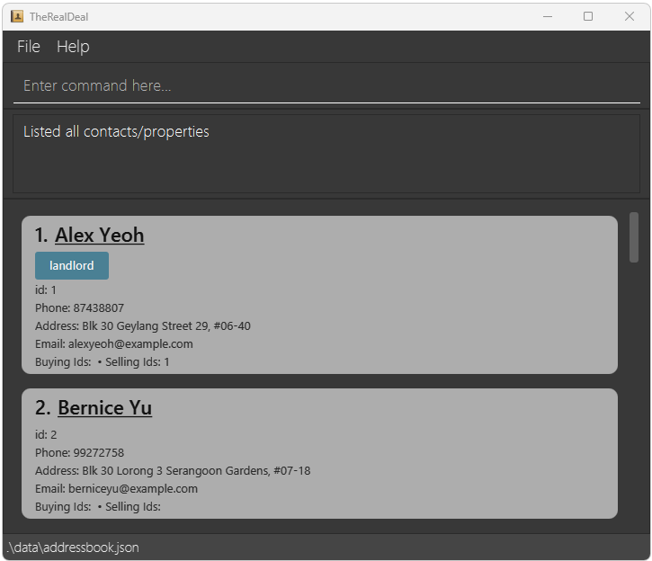

TheRealDeal is a **desktop app for real estate agents, optimised for use via a Command Line Interface** (CLI) to streamline contact management by providing **quick access to contact preferences and available properties**. The faster you type, the faster TheRealDeal can help you find what you need.

* Table of Contents
{:toc}

--------------------------------------------------------------------------------------------------------------------

## Quick start

1. Ensure you have Java `17` or above installed in your Computer. 
   **Windows users:** Tutorial to download [here](https://se-education.org/guides/tutorials/javaInstallationWindows.html) 
   **Linux users:** Tutorial to download [here](https://se-education.org/guides/tutorials/javaInstallationLinux.html) 
   **Mac users:** Ensure you have the precise JDK version prescribed [here](https://se-education.org/guides/tutorials/javaInstallationMac.html).

2. Download the latest `.jar` file from [here](https://github.com/AY2526S1-CS2103T-W10-2/tp/releases).

3. Copy the file to the folder you want to use as the _home folder_ for TheRealDeal.

4. Open a command terminal, `cd` into the folder you put the jar file in, and use the `java -jar TheRealDeal.jar` command to run the application. 
   A GUI similar to the below should appear in a few seconds. Note how the app contains some sample data. 
   
*Confused? Refer to [**Basic Command Terminal Navigation**](#basic-command-terminal-navigation) at the bottom of the user guide.*

### GUI Overview

TheRealDeal GUI is organised into **four** key components:

* `Menu Bar`: Located at the top left, this includes options such as `File` and `Help` for managing settings and accessing support.
* `Command Box`: The main area where users can enter commands to interact with the app.
* `Result Display`: Provides immediate feedback, displaying success or failure messages based on the user’s command. Situated below the `Command Box`.
* `List Card`: Displays key information about contacts or listings, depending on the user's command. Situated below the `Result Display`.

Type the command in the command box and press Enter to execute it. e.g. typing **`help`** and pressing Enter will open the help window. 
   Some example commands you can try:

   * `list` : Lists all contacts.

   * `addcontact n/John Doe p/98765432 e/johnd@example.com a/John street, block 123, #01-01` : Adds a contact named `John Doe` to the Address Book.

   * `deletecontact 3` : Deletes the 3rd contact shown in the current list.

   * `clear` : Deletes all contacts.

   * `exit` : Exits the app.

Refer to the [Features](#features) below for details of each command.

--------------------------------------------------------------------------------------------------------------------

## Features

**:information_source: Notes about the command format:** 

* Words in `UPPER_CASE` are the parameters to be supplied by the user. 
  e.g. in `addcontact n/NAME`, `NAME` is a parameter which can be used as `addcontact n/John Doe`.

* Items in square brackets are optional. 
  e.g `n/NAME [t/TAG]` can be used as `n/John Doe t/buyer` or as `n/John Doe`.

* Items with `…`​ after them can be used multiple times. Items can be used zero times if they are also wrapped in square brackets. 
  e.g. `[t/TAG]…​` can be used as ` ` (i.e. 0 times), `t/friend`, `t/friend t/family` etc.

* Parameters can be in any order. 
  e.g. if the command specifies `n/NAME p/PHONE_NUMBER`, `p/PHONE_NUMBER n/NAME` is also acceptable.

* Extraneous parameters for commands that do not take in parameters (such as `help`, `list`, `exit` and `clear`) will be ignored. 
  e.g. if the command specifies `help 123`, it will be interpreted as `help`.

* If you are using a PDF version of this document, be careful when copying and pasting commands that span multiple lines as space characters surrounding line-breaks may be omitted when copied over to the application.

### Viewing help : `help`

Shows a message explaining how to access the help page

Format: `help`

### Listing all contacts and properties: `list`

Displays all contacts and properties in the app. It resets any active filters and shows the complete list.

Both contact and property cards display an ID field which represents the `UUID` of that contact/property.
This `UUID` will be used for other commands.

Format: `list`

### Adding a contact : `addcontact`

Adds a new contact to the system, with details of the contact.

Format: `addcontact n/NAME p/PHONE_NUMBER [e/EMAIL] [a/ADDRESS] [min/AMOUNT] [max/AMOUNT] [t/TAG] [notes/TEXT] [s/STATUS]`

:information_source:
TEXT for notes has a maximum length of 500 characters  

Examples:
* `addcontact n/Charlie p/91236789 a/982 Tampines Road t/buyer s/active`
* `addcontact n/Xi Mi p/65738475 e/ximi@example.com min/800000 max/1000000`

### Editing a contact : `editcontact`

Edits an existing contact in the address book.

Format: `editcontact UUID [n/NAME] [p/PHONE] [e/EMAIL] [a/ADDRESS] [min/AMOUNT] [max/AMOUNT] [t/TAG] [notes/TEXT] [s/STATUS]`

* Edits the contact that has the UUID specified `UUID`. 
* The UUID refers to the ID number shown in the displayed contact list.
* At least one of the optional fields must be provided.
* When editing tags, the existing tags of the contact will be removed i.e adding of tags is not cumulative.
* You can remove all the contact’s tags by typing `t/` without specifying any tags after it.

Examples:
*  `edit 1 p/91234567 e/johndoe@example.com` 
*  `edit 2 n/Betsy Crower t/`

### Filtering contact : `filtercontact`

Filters the contacts based on the fields given

Format: `filtercontact [n/NAME] [p/PHONE] [e/EMAIL] [a/ADDRESS] [min/AMOUNT] [max/AMOUNT] [t/TAG] [notes/TEXT] [s/STATUS] [limit/LIMIT] [offset/OFFSET]`

* The search is case-insensitive. e.g `hans` will match `Hans`
* Substring words will be matched e.g. `Han` will match `Hans`
* Contacts matching at least one keyword will be returned

Examples:
* `filtercontact a/yishun`
* `filtercontact n/Tan s/active`

### Deleting a contact : `deletecontact`

Deletes the specified contact from the address book.

Format: `deletecontact UUID`

* Deletes the contact with the specified `UUID`.
* The UUID refers to the id number shown in the displayed contact list.
* The command only works on contacts currently visible in the property list panel. Use the [list](#listing-all-contacts-and-properties-list) command first if needed.

Examples:
* `deletecontact 1`

### Adding a property: `addproperty`

Adds a property to the property list.

Format: `addproperty address/ADDRESS postal/POSTAL price/PRICE type/TYPE status/STATUS bedroom/BEDROOM bathroom/BATHROOM floorarea/FLOOR_AREA listing/LISTING owner/CONTACT_ID`

* `address/ADDRESS` must be 5-200 characters long and contain at least one letter and one digit.
* `postal/POSTAL` must be a 6-digit Singapore postal code.
* `price/PRICE` must be a positive integer up to 1,000,000,000,000.
* `type/TYPE` accepts `hdb`, `condo`, `landed`, `apartment`, `office`, or `others` (case-insensitive).
* `status/STATUS` accepts `available` or `unavailable` (case-insensitive).
* `bedroom/BEDROOM` and `bathroom/BATHROOM` accept integers from 0 to 20.
* `floorarea/FLOOR_AREA` accepts integers from 50 to 100000 (square feet).
* `listing/LISTING` accepts `sale` or `rent` (case-insensitive). A property marked as `sold` cannot be listed for `rent`.
* `owner/CONTACT_ID` should be the UUID of an existing contact.
* The command rejects properties that share both the same address and postal code as an existing property.
* Each new property is assigned the next available UUID automatically; you do not provide an ID when adding it.

Examples:
* `addproperty address/123 Orchard Rd postal/238888 price/1950000 type/condo status/sold bedroom/3 bathroom/2 floorarea/1023 listing/sale owner/1`
* `addproperty address/55 Pasir Ris Dr 1 postal/519884 price/450000 type/hdb status/unsold bedroom/4 bathroom/2 floorarea/1050 listing/rent owner/5`

### Filtering contact : `filterproperty`

Filters the properties based on the fields given.

Format: `filterproperty [address/ADRESS] [postal/POSTAL] [type/TYPE] [bedroom/BEDROOM] [bathroom/BATHROOM] [floorarea/FLOORAREA] [status/STATUS] [price/PRICE] [listing/LISTING] [owner/OWNER] [limit/LIMIT] [offset/OFFSET]`

* The search is case-insensitive. e.g `clementi` will match `Clementi`
* Property with address with substring address will be matched e.g. `Clementi` will match `CLementi Avenue 8`
* Property matching all the filter will be returned

Examples:
* `filterproperty address/yishun`
* `filterproperty bedroom/2 floorarea/100`

### Deleting a property: `deleteproperty`

Deletes a property identified by its UUID.

Format: `deleteproperty UUID`

* Deletes the property with the specified `UUID`.
* The UUID refers to the id number shown in the displayed property list.
* The command only works on properties currently visible in the property list panel. Use the [list](#listing-all-contacts-and-properties-list) command first if needed.

Examples:
* `deleteproperty 12`
* `deleteproperty 3`

### Linking people and properties : `link`

Links people to properties as buyers or sellers by their UUIDs.

Format: `link c/CONTACT_ID... r/RELATIONSHIP p/PROPERTY_ID...`

* `RELATIONSHIP` **must be either `buyer` or `seller`**
* `CONTACT_ID` and `PROPERTY_ID` refer to the UUIDs of the people and properties being linked respectively.
* `link` can link any number of properties and people at once (excluding none).

### Unlinking people and properties : `unlink`

Unlinks people from properties as buyers and sellers, at the same time, by their UUIDs.

Format: `link c/CONTACT_ID... p/PROPERTY_ID...`

* `CONTACT_ID` and `PROPERTY_ID` refer to the UUIDs of the people and properties being linked respectively.
* `unlink` can unlink any number of properties and people at once (excluding none).

### Showing properties associated with a contact : `showproperties`

Displays all properties associated with a specific contact by their UUID.

Format: `showproperties c/CONTACT_UUID`

* `CONTACT_UUID` refers to the UUID of the contact shown in the contact list.
* The view automatically switches to show the property list.
* If no properties are found, suggestions will be provided.

Examples:
* `showproperties c/1`
* `showproperties c/123`

### Showing contacts associated with a property : `showcontacts`

Displays all contacts associated with a specific property by their UUID.

Format: `showcontacts p/PROPERTY_UUID`

* `PROPERTY_UUID` refers to the UUID of the property shown in the property list.
* The view automatically switches to show the contact list.
* If no contacts are found, suggestions will be provided.

Examples:
* `showcontacts p/1`
* `showcontacts p/12`

### Clearing all entries : `clear`

Clears all entries from the address book.

Format: `clear`

### Exiting the program : `exit`

Exits the program.

Format: `exit`

### Saving the data

TheRealDeal data is saved in the hard disk automatically after any command that changes the data. There is no need to save manually.

### Editing the data file

TheRealDeal data is saved automatically as two JSON files 
1. `[JAR file location]/data/addressbook.json`
2. `[JAR file location]/data/propertybook.json`

Advanced users are welcome to update data directly by editing that data file.

:exclamation: **Caution:**
If your changes to the data file makes its format invalid, TheRealDeal will discard all data and start with an empty data file at the next run. Hence, it is recommended to take a backup of the file before editing it. 
Furthermore, certain edits can cause the TheRealDeal to behave in unexpected ways (e.g., if a value entered is outside of the acceptable range). Therefore, edit the data file only if you are confident that you can update it correctly.

--------------------------------------------------------------------------------------------------------------------

## FAQ

**Q**: How do I transfer my data to another Computer? 
**A**: Install the app in the other computer and overwrite the empty data file it creates with the file that contains the data of your previous AddressBook home folder.

--------------------------------------------------------------------------------------------------------------------

## Known issues

1. **When using multiple screens**, if you move the application to a secondary screen, and later switch to using only the primary screen, the GUI will open off-screen. The remedy is to delete the `preferences.json` file created by the application before running the application again.
2. **If you minimize the Help Window** and then run the `help` command (or use the `Help` menu, or the keyboard shortcut `F1`) again, the original Help Window will remain minimized, and no new Help Window will appear. The remedy is to manually restore the minimized Help Window.

--------------------------------------------------------------------------------------------------------------------

## Command summary

Action | Format, Examples
--------|------------------
**Add Contact** | `addcontact addcontact n/NAME p/PHONE_NUMBER [e/EMAIL] [a/ADDRESS] [min/AMOUNT] [max/AMOUNT] [t/TAG] [notes/TEXT] [s/STATUS]`     e.g., `addcontact n/Alex p/91423123 a/982 Yishun Road t/buyer s/active notes/wants near school min/100000 max/300000`
**Edit Contact** | `editcontact UUID [n/NAME] [p/PHONE] [e/EMAIL] [a/ADDRESS] [min/AMOUNT] [max/AMOUNT] [t/TAG] [notes/TEXT] [s/STATUS]`    e.g.,`edit 2 n/Bobby a/Block 321 Punggol`
**Filter Contact** | `filtercontact [n/NAME] [p/PHONE] [e/EMAIL] [a/ADDRESS] [min/AMOUNT] [max/AMOUNT] [t/TAG] [notes/TEXT] [s/STATUS] [limit/LIMIT] [offset/OFFSET]`    e.g.,`filtercontact n/Tan s/active`
**Delete Contact** | `deletecontact INDEX`    e.g., `deletecontact 3`
**Add Property** | `addproperty address/ADDRESS postal/POSTAL price/PRICE type/TYPE status/STATUS bedroom/BEDROOM bathroom/BATHROOM floorarea/FLOOR_AREA listing/LISTING owner/OWNER_ID`    e.g., `addproperty address/123 Orchard Rd postal/238888 price/1950000 type/condo status/sold bedroom/3 bathroom/2 floorarea/1023 listing/sale owner/1`
**Filter Property** | `filterproperty [address/ADRESS] [postal/POSTAL] [type/TYPE] [bedroom/BEDROOM] [bathroom/BATHROOM] [floorarea/FLOORAREA] [status/STATUS] [price/PRICE] [listing/LISTING] [owner/OWNER] [limit/LIMIT] [offset/OFFSET]`    e.g., `filterproperty bedroom/2 price/2000`
**Delete Property** | `deleteproperty UUID`     e.g., `deleteproperty 12`
**Link** | `link c/CONTACT_ID... r/RELATIONSHIP p/PROPERTY_ID...`     e.g., `link c/12 r/buyer p/12 p/4`
**Unlink** | `unlink c/CONTACT_ID... p/PROPERTY_ID...`    e.g., `link c/1 p/14 c/2`
**List** | `list`
**Clear** | `clear`
**Help** | `help`

## Basic Command Terminal Navigation
1. Determine the address of the folder where TheRealDeal is installed.
2. Open "Powershell" on Windows or "Terminal" on MacOS and Linux.
3. Type `cd ADDRESS`, where `ADDRESS` is the address where TheRealDeal is installed, and hit enter.
4. Type `java -jar TheRealDeal.jar`, and hit enter, to run the application.
